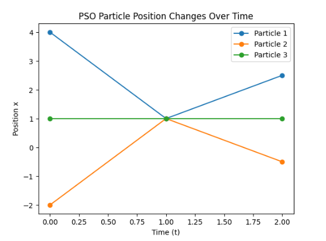

# Particle Swarm Optimization (PSO)
Particle Swarm Optimization (PSO), doğadaki kuş ve balık sürülerinin yiyecek aramak veya bir yerden başka bir yere göç etmek için uyguladıkları yöntemleri taklit ederek oluşturulmuş stokastik bir algotitmadır. 1990'ların başında James Kennedy (Sosyal pisikolog) ve Russell Eberhart(Elektirik Mühendisi) adlı iki bilim insanının kuş ve balık sürülerinin davranışlarını bir matematik modelel olarak ortaya koyma çlaışmalarına dayanır. Kennedy ve Eberhart , 1995 yılında bu davranış modelinin, sayısal problemlerde çözüm olarak kullanılabileceğini fark ederek yayınladıkları "Partical Swarm Optimization" - 1995, IEEE makelesiyle bilim dünyasına duyurulmuştur.

1998 - 2002 arasında modellerine, inertia weight (w), bireysel (c₁) ve sosyal (c₂) terimleri eklenerek yaklaşma davranışı kontrol altına alarak modeli daha da olgunlaştırmışlardır.

# Kullanım Alanları
Bir sayısal denklemin türevi alınarak bu denklemin eğitimi tespit edilebilir. Bu sayade verilecek paremetlerlerin büyüklükleri tespit edilerek yönün aşağı mı yukarımı çıkacağı bulunabilir. Bu yaklaşımı kullanan Gradient Descent, bir noktanın grafikteki eğimine bakarak aşağıya nasıl gidilebileceği bulabilir. Böylece o noktadan daha iyi bir noktaya (aşağıya) nasıl gidilebileceğini tespit edebilir. Bu yaklaşım, alan pürüzsüzse veya çok fazla girinti çıkıntı yoksa sistmei hızlıca sonuca ulaştırır. Ama yüzey çok bozuksa, dolayısyla çok fazla çukur ve çıkıntı varsa yanıltıcı sonuçlar üretebilir. Özetle Gradient Descent eğime güvenir.

PSO ise eğime güvenmez bunun yerine birden fazla noktaya aynı anda parçacıkları sayesinde gezer. Hangi parçacık iyi bir konum bulduysa diğerlerine haber vererek tüm sürünün yavaş yavaş o noktaya kaymasını sağlar. Bu yaklaşımı ile türevi alınamayan veya alınsa bile çok karmaşık yüzeylerin yada çok paremetreli sistmelerin çözümünde etkili bir çözüm sunar.

## Dron Örneği
Bir arama kurtarma bölgesi düşünün. Bu alan çok büyük, inişlerin çıkışların çok fazla , görüş mesafesinin yer yer farklı olan zor bir arazi. Böyle bir arazide tek bir dron ile arama yapan Gradient Descent algoritması şöyle davranır;
- Dron zemine bakar
- Eğimi hesaplar
- Aşağıya doğru giden bir yön bulur ve gider.

Bu durumda dron daha alçak bir noktaya ilerlemiş olsa bile bu yer arazideki en alçak yer olmayabilir. Dron ileride daha iyi bir konumun olduğunu bilemez.BU durumu aşmak için farklı uygulamalar, iyilaştirmeler vardır.

PSO algoritması ise bu arazide şöyel davranır. N tane dron aynı anda havalanır. Hepsi Farklı yerlere gider ve her bir dron şunu yapar;
- Bulunduğum yerde konum iyi mi ?
- Daha önce gittiğim yerler arasında en iyi hangisi?
- Diğer dronlardan biri benden daha iyi bir yerde mi ?

Bir dron herkezden daha iyi bir konum bulduğunda diğerleri o yöne doğru yavaş yavaş kaymaya başlar. Bu kayma yavaş yavaş olur ve tüm sürü birden bire aynı noktaya toplanmaz. Böylece, algortma keşif/sömürü dengesini kurmuş olur. Tüm sürü aynı anda en iyi olan noktaya gitmeyerek yol üzeirndeki olası daha iyi konumu sürüye bildirme şansını kaybetmezler ama yavaş yavaş aynı noktaya kayarak tüm parçacıkların en iyi yer egelmesini sağlarlar.

#Hız Denklemi
Dron sürüsü örneğinde, her dronun aynı and ahavandığını ve farklı yönlere gittiklerinden bahsettik. Peki dronlar farklı yönlere nasıl dağılırlar. İlk başlangıçtadronlar aynı anda havalandığı için hepsi aynı hızda yanı 0 olacaklardır. Hız denklemi parçacıkların mevcut konumlarına göre yeni hızlarını hesaplayıp dronların hızı değiştiğinde doğal olarak aralarındaki mesafe farklılaşacaktır.

PSO algoritmasında bir parcacığun bir sonraki adımda nereye gideceğini belirleyen hızdenklemi (velocity equation), üç temel bileşenden oluşur. Bu bileşenler, parçacığın hem kendi geçmişine hemde sürünün(sosyal) bilgisine daynarak hareket etmesini sağlar.

**PSO Hız Güncelleme Formulü**

$`\vec{v}_i^{(t+1)} = w\,\vec{v}_i^t+ c_1 r_1\big(\vec{pBest}_i^t - \vec{x}_i^t\big)+ c_2 r_2\big(\vec{gBest}^t - \vec{x}_i^t\big)`$

&nbsp;
&nbsp;

 **Intertia (Atalet)**
 Bu bileşen  $` w\,\vec{v}_i^t`$ , parçacığın mevcut hareket yönünü ve hızını koruma eğilimidir. Atalet ağırlığı adı verilen bu değişken ( w ) ile çarpılır. Bu bileşenin temel görevi, parçacığın aniden yön değiştirmesini engelleyerek arama uzayında daha genişalanaların taranmasını sağlamaktır. (Keşif/exploration)
&nbsp;

 **Individual Component (Bireysel Bileşen)**
 Bu bileşen $`c_1 r_1\big(\vec{pBest}_i^t - \vec{x}_i^t\big)`$ , parçacığın hendi geçmişinde ulaştığı en iyi konum (pBest) ile mevcut konumu arasındaki mesafeyi belirtir. Bu bileşen c1 katsayıs ile kontrol edilir.
&nbsp;

**Social Component (Sosyal Bileşen)** 
Bu bileşen $` c_2 r_2\big(\vec{gBest}^t - \vec{x}_i^t\big)`$, parçacığın mevcut konumu ile tüm sürünün şimdiye kadarki en iyi konumu {gBest} arasındaki mesafeyi hesaplar. Bu  da parçacıkların birbirleriyle iletişim kurması ve sürünün kollektif hareket etmesini sağlar Bu bileşen c2 katsayıs ile yönetilir.
&nbsp;

Bu formülle, parçacığın mevcut hızını kendi başarılarını ve arkadaşlarının başarısını bir araya getirerek bir vektör oluşturur.

## Örnek-I
3 parçacıktan oluşan bir sürüde, $`f(x) = x^2 `$ amaç fonksyonu minimize edecek sonuca ulaşmak istiyoruz. Bu amaçla algoritmanın $`w=0.5`$, $`c_1=1`$ , $`c_2=1`$  ve $`r1=r2=1`$  değerleri ile iki iterasyon ilerletelim.

## Çözüm

### Başlangıç ($`t = 0`$)

$`t = 0`$ anında parçacıkların konumları rastgele belirlenir. Yani arazi üzerine rastgele dağıtılırlar. Parçaçıkların $`t = 0`$ anındaki hızlarıda 0' dır. Böylece;

- Parçacıkların başlangıç konumları: $`x_1^0 = 4, x_2^0 = -2`$ ve $`x_3^0 = 1`$ olarak rastgele atanır.
- Başlangıç anında parçaçıkların aynı ve $`v_1^0 =v_2^0 =v_3^0 = 0`$ dır.

Parçaların $`t = 0`$ anındaki konumları $`f(x)=x^2`$ amaç foksiyonuna x değeri olarak konularak sürünün en iyi konumu belirlenmeye çalışılır.

- $`x_1= 4`$ => $`f(x)=x^2`$ 'den $`f(4)=(4)^2 = 14`$
- $`x_2=-2`$ => $`f(x)=x^2`$ 'den $`f(-2)=(-2)^2 = 4`$
- $`x_1= 4`$ => $`f(x)=x^2`$ 'den $`f(1)=(1)^2 = 1`$

Bu sonuçlara göre en düşük değer $`f(1)= 1`$ değeridir. Bu değeri algoritmanın $`gBest`$ değerine yani sürünün en iyi konum değerine  $`gBest=1`$ olarak atıyoruz. Artık hiz formulümüzü kullanarak parçacıkların bir sonraki an için hızlarını ve konumlarını belirleyebiliriz. Çünkü $`\vec{v}_i^{(t+1)} = w\,\vec{v}_i^t + c_1 r_1\big(\vec{pBest}_i^t - \vec{x}_i^t\big) + c_2 r_2\big(\vec{gBest}^t - \vec{x}_i^t\big)`$ formülde kullanılmak üzere $`\vec{gBest}`$, ve $`\vec{pBest}`$ değerleri elimizde artık mevcut. Buradan;
&nbsp;
&nbsp;
&nbsp;
- $`t=0`$ için $`\vec{v}_i^{(t+1)}`$ değeri $`\vec{v}_i^{(0+1)}`$ dan $`\vec{v}_i^1`$ olacaktır.
- Böylece parçaçığın $`t=1`$ değeri için hızını, hız değişim formülünden hesaplayabiliriz.
- Aynı şekilde parçaçığın $`t=1`$ anın için konumu $`x_i^{t+1} = x_i^t + \vec{v}_i^{t+1}`$ formülünden hesaplayabiliriz.
- $`w=0.5`$, $`c_1=1`$ , $`c_2=1`$  ve $`r1=r2=1`$ olarak soruda verilmişti.
- Artık elimizde $`\vec{gBest}`$, ve $`\vec{pBest}`$ değerleri de mevcut. 
&nbsp;
&nbsp;

**Parçacık-1**

- $`t=1`$ anı için hız, $`\vec{v}_1^{(1)} = (0.5).(0) +(1).(1).(4-4) + (1).(1).(1-4) = -3`$ 
- $`t=1`$ anı için konum, $`x_1^{1} =4 + (-3) = 1`$  olarak hesaplanır.

**Parçacık 2**

- $`t=1`$ anı için hız, $`\vec{v}_2^{(1)} = (0.5).(0) +(1).(1).(-2-(-2)) + (1).(1).(1-(-2)) = 3`$ 
- $`t=1`$ anı için konum, $`x_2^{1} = -2 + 3= 1`$  olarak hesaplanır.

**Parçacık 3**

- $`t=1`$ anı için hız, $`\vec{v}_3^{(1)} = (0.5).(0) +(1).(1).(1-1) + (1).(1).(1-1) = 0`$ 
- $`t=1`$ anı için konum, $`x_3^{1} = 1-1= 0`$  olarak hesaplanır.

Buradan;

$`t=1`$  anı için yeni bulunan $`x`$ değerleri $`f(x)=x^2`$ amaç fonyonuna konularak sürünün yeni $`gBest`$  değeri hesaplanır:

- $`x_1^1 = 1`$ için  $`f(x)=x^2`$ ise $`f(1)=1^2= 1`$
- $`x_2^1 = 1`$ için  $`f(x)=x^2`$ ise $`f(1)=1^2= 1`$
- $`x_3^1 = 1`$ için  $`f(x)=x^2`$ ise $`f(1)=1^2 =1`$ 

Bu hesaplama sonucunda tüm parçacıklar aynı noktada olduğundan birinin en iyi değerini $`gBest = 1`$ olarak atıyoruz.

**Iterasyon 1 ($`t=2`$)**

 Halen parçacıklar aynı konumda yanı 1 konumundalar ama artık hepsinin farklı bir hızı var. Bu nedenle $`t=2`$ hesaplamalarında farklı $`x`$ değerleri görmeye başlayacağız.

**Parçacık-1**

- $`t=1`$ anı için hız, $`\vec{v}_1^{(2)} = (0.5).(-3) +(1).(1).(1-1) + (1).(1).(1-1) = -1.5`$ 
- $`t=1`$ anı için konum, $`x_1^{2} = 1 + (-1.5) = 0.5`$  olarak hesaplanır.

**Parçacık 2**

- $`t=1`$ anı için hız, $`\vec{v}_2^{(2)} = (0.5).(3) +(1).(1).(1-1) + (1).(1).(1-1) = 1.5`$ 
- $`t=1`$ anı için konum, $`x_2^{2} = 1 + 1.5 = 2.5`$  olarak hesaplanır.

**Parçacık 3**

- $`t=1`$ anı için hız, $`\vec{v}_3^{(2)} = (0.5).(0) +(1).(1).(1-1) + (1).(1).(1-1) = 0`$ 
- $`t=1`$ anı için konum, $`x_3^{2} = 1 +0 = 1`$  olarak hesaplanır.

&nbsp;
Buradan;
&nbsp;
$`t=2`$  anı için yeni bulunan $`x`$ değerleri $`f(x)=x^2`$ amaç fonyonuna konularak sürünün yeni $`gBest`$  değeri hesaplanır:

- $`x_1^2 = 0.5`$ için  $`f(x)=x^2`$ ise $`f(0.5)=(0.5)^2= 0.25`$
- $`x_2^2 = 2.5`$ için  $`f(x)=x^2`$ ise $`f(2.5)=(2.5)^2= 6.25`$
- $`x_3^2 = 1`$ için  $`f(x)=x^2`$ ise $`f(1)=1^2 =1`$ 

&nbsp;
bu durumda $`gBest= 0.25`$ olur. Sonuç olarak $`t=0$` anından $`t=2$ anına kadar olan değişim aşağıdaki tablodaki gibi özetlenebilir

| Zaman (t) | Parçacık | Konum $`(x_i^t)`$ | Hız $`x_i^t`$ |  $`f(x_i^t)`$ | pBest_i | gBest |
|-----------|----------|---------------|-------------|----------|---------|-------|
| 0 | 1 | 4    | 0    | 16   | 4   | 1 |
| 0 | 2 | -2   | 0    | 4    | -2  | 1 |
| 0 | 3 | 1    | 0    | 1    | 1   | 1 |
| 1 | 1 | 1    | -3   | 1    | 4   | 1 |
| 1 | 2 | 1    | 3    | 1    | -2  | 1 |
| 1 | 3 | 1    | 0    | 1    | 1   | 1 |
| 2 | 1 | 2.5  | 1.5  | 6.25 | 4   | 0.25 |
| 2 | 2 | -0.5 | -1.5 | 0.25 | -2  | 0.25 |
| 2 | 3 | 1    | 0    | 1    | 1   | 0.25 |

